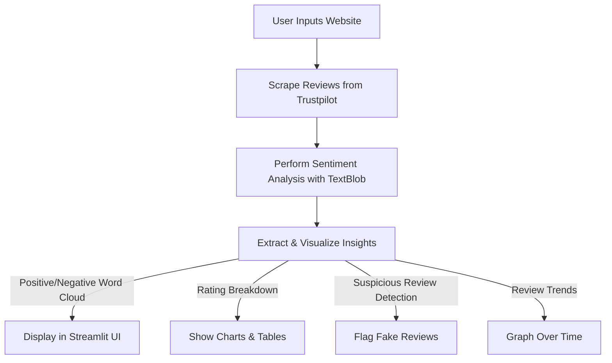

# 📊 Trustpilot Review Analyzer

## Overview
Trustpilot Review Analyzer is a **Streamlit-powered web application** that scrapes customer reviews from **Trustpilot**, performs **sentiment analysis** using **TextBlob**, and provides insightful visualizations. This tool helps businesses and consumers analyze brand reputation, detect suspicious reviews, and monitor trends over time.

## 📑 Table of Contents
- [Features](#features)
- [Live Demo](#live-demo)
- [How It Works](#how-it-works)
- [Installation & Running Locally](#installation--running-locally)
- [Project Workflow](#project-workflow)
- [Technologies Used](#technologies-used)
- [Contributing](#contributing)
- [License](#license)
- [Acknowledgments & References](#acknowledgments--references)

## 🚀 Features
✅ **Web Scraping** – Fetches real-time reviews from Trustpilot.  
✅ **Sentiment Analysis** – Uses **TextBlob** to classify reviews as **positive, negative, or neutral**.  
✅ **Keyword Extraction** – Identifies **common positive and negative words** in reviews.  
✅ **Rating Breakdown** – Analyzes and displays reviews for each rating (1-star to 5-star).  
✅ **Suspicious Comments Detection** – Flags **potential fake or repetitive reviews**.  
✅ **Review Flow Analysis** – Visualizes **customer feedback trends over time**.  
✅ **Streamlit Web Interface** – User-friendly app to search for any website’s reviews.  

## 🎥 Live Demo
🔗 Access the application here: **[trustpilotanalysis](https://trustpilotanalysis.streamlit.app/)**  

  

## 🛠 How It Works
1. Open the **[Trustpilot Review Analyzer](https://trustpilotanalysis.streamlit.app/)** in your browser.
2. Enter the **website name** (e.g., `example.com`).
3. Click **Search** to fetch and analyze reviews.
4. Explore the **sentiment insights, word clouds, rating breakdown, and trends**.

## 💻 Installation & Running Locally

### Prerequisites
Ensure you have **Python 3.8+** installed.

### Install Dependencies
```bash
pip install -r requirements.txt
```

### Run the Application
```bash
streamlit run app.py
```

## 🔄 Project Workflow


## 🛠 Technologies Used
- **Python** – Core language
- **Streamlit** – Web interface
- **BeautifulSoup** – Web scraping
- **TextBlob** – Sentiment analysis
- **Matplotlib & Seaborn** – Data visualization
- **WordCloud** – Keyword extraction

## 🤝 Contributing
We welcome contributions! To contribute:
1. Fork the repository.
2. Create a new branch (`git checkout -b feature-name`).
3. Commit your changes (`git commit -m 'Added new feature'`).
4. Push to the branch (`git push origin feature-name`).
5. Open a Pull Request.


## 📚 Acknowledgments & References
- Trustpilot API & scraping techniques.
- [TextBlob Documentation](https://textblob.readthedocs.io/)
- [Streamlit Documentation](https://docs.streamlit.io/)
- Open-source contributors who improve web scraping & sentiment analysis.
